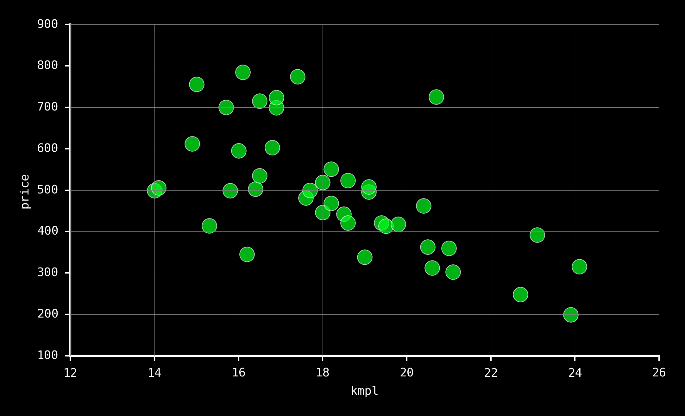
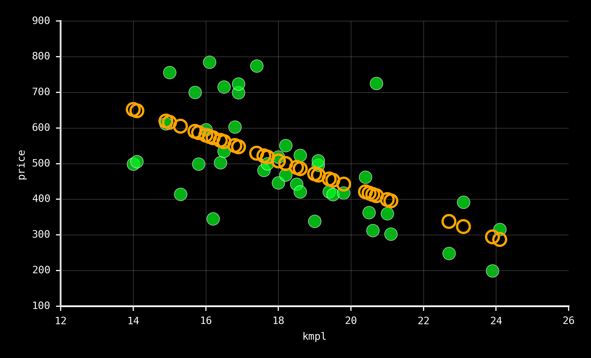
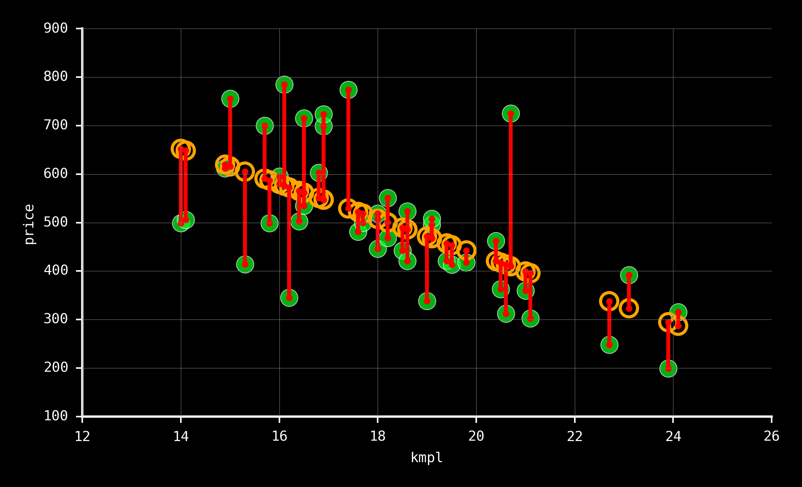
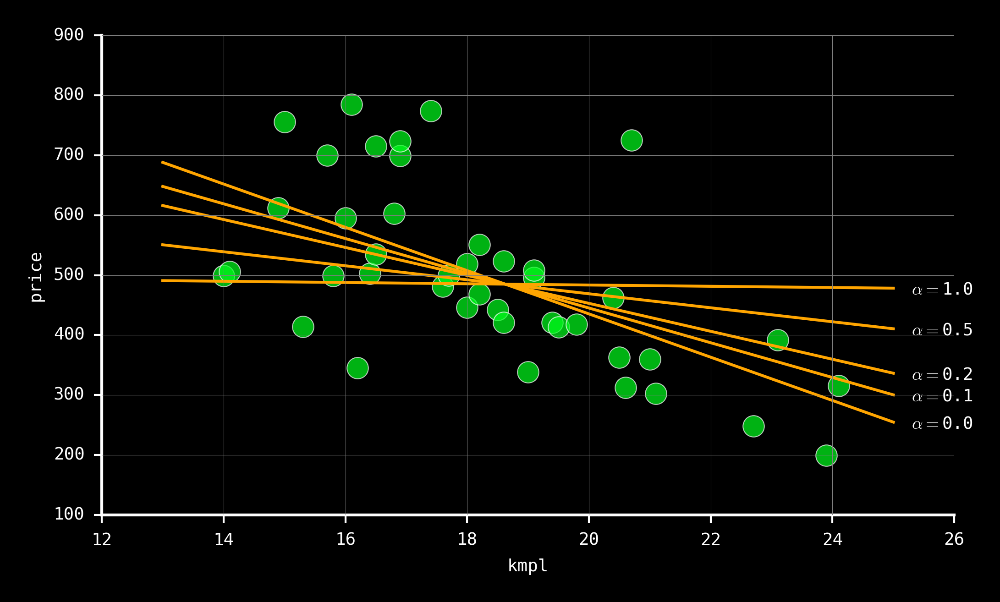
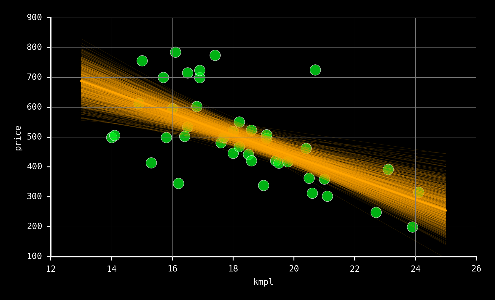
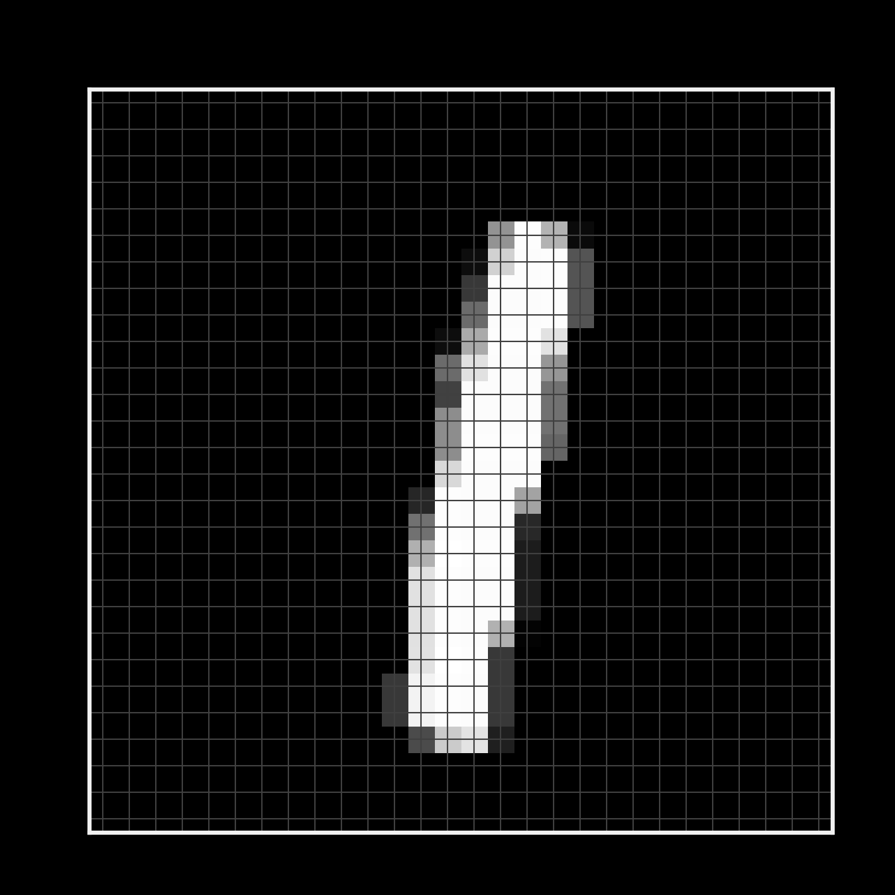
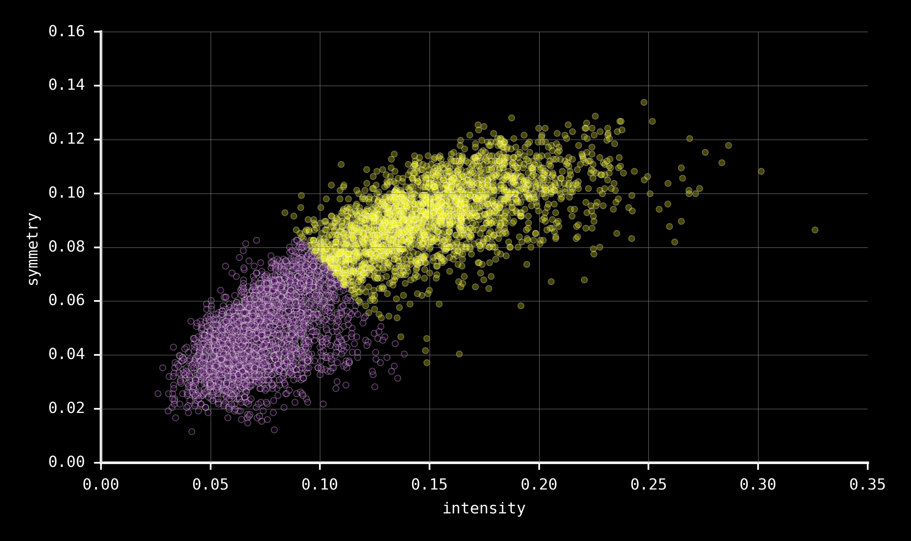
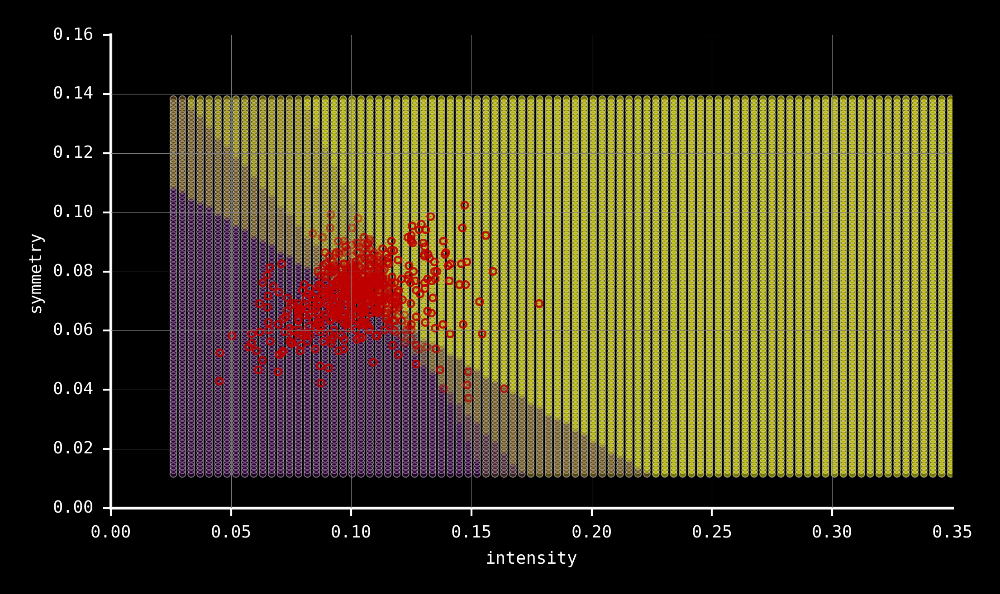

theme: Olive Green, 8

# [fit] **Visualising ML Models**
## ___
## Amit Kapoor
## @amitkaps

---

# **Story**
## ___
## “We don’t see things as they are, we see them as we are.”
### *— Anais Nin*

---

# **The Blind Men & the Elephant**
## ___
### “And so these men of Indostan
### Disputed loud and long,
### Each in his own opinion
### Exceeding stiff and strong,
### Though each was partly in the right,
### And all were in the wrong.”
#### — *John Godfrey Saxe*

---

# **The Elephant: Data**
## ___
## “Data is just a clue to the end truth”
### *— Josh Smith*

---

# **The Men: Building Models**
## ___
## "All models are wrong, but some are useful"
### *— George Box*

---

# **Layers of Abstraction**
## ___
## **Data** Abstraction
## **Visual** Abstraction
## **Model** Abstraction

---

# **Machine Learning (ML) Speak**
## ___
## **Data** Transformation
## **Visual** Exploration
## **Model** Building

---

# **ML Pipeline**
## ___

### Data Transformation  — — — —  Model Building
###    *(Tidy Data)*                                 
###         │                                 
###         │                                 
###         │                                 
### Visual Exploration   
###    *(Data-Vis)*       

---

# **ML Pipeline++**
## ___

### Data Transformation  — — — —  Model Building
###    *(Tidy Data)*                 **_(Tidy Model)_**      
###         │                           │     
###         │                           │     
###         │                           │     
### Visual Exploration           **Model Exploration**
###    *(Data-Vis)*                   **_(Model-Vis)_**

---

# **Model Exploration**
## ___
## Use visualisation to aid the transition of **implicit knowledge** in the data and your head to **explicit knowledge** in the model.

---

# **Model-Vis Approach**
## ___
### **[0]** Visualise the **data space**
### **[1]** Visualise the **predictions in the data space**
### **[2]** Visualise the **errors in model fitting**
### **[3]** Visualise with **different model parameters**
### **[4]** Visualise with **different input datasets**
### **[5]** Visualise the **entire model space**
### **[6]** Visualise the **entire feature space**
### **[7]** Visualise the **many models together**

---

# **Model-Vis Examples**
## ___
### Regression: Small (n < 50, p = 4)
### Classification: 2 class (n ~ 60K, p = 2)
### Classification: 10 class (n ~ 2K, p = 10)
### Regression: N-models (n ~ 60K, p = 4)

---

# **Regression: Small**
## ___
## Cars dataset - **price vs kmpl**
## Scraped from **comparison** website
## Refined & **tidied** up
## **Base version** for **petrol** cars
## Price **< ₹ 1,000K**, n = **42**

---

**brand**    **model**    **price**    **kmpl**    **type**        **bhp**
Tata     Nano       199    23.9	   Hatchback    38
Suzuki   Alto800    248    22.7	   Hatchback    47
Hyundai  EON        302    21.1	   Hatchback    55
Nissan   Datsun     312    20.6	   Hatchback    67
...      ...        ...    ...     ...         ...

Suzuki   Ciaz       725	   20.7	   Sedan        91
Skoda    Rapid      756	   15.0	   Sedan       104
Hyundai  Verna      774	   17.4	   Sedan       106
VW       Vento      785	   16.1	   Sedan       104

---

###   [0] Visualise the **data space**



---

###   [1] Visualise the **predictions in the data space**


---

###   [2] Visualise the **errors in model fitting**


---

###   [3] Visualise with **different model parameters**


---

###   [4] Visualise with **different input datasets**


---

###   [5] Visualise the **entire model space**


---

###   [6] Visualise the **entire feature space**


---

###   [7] Visualise the **many models together**


---

# **Model-Vis Approach**
## ___
### **[0]** Visualise the **data space**
### **[1]** Visualise the **predictions in the data space**
### **[2]** Visualise the **errors in model fitting**
### **[3]** Visualise with **different model parameters**
### **[4]** Visualise with **different input datasets**
### **[5]** Visualise the **entire model space**
### **[6]** Visualise the **entire feature space**
### **[7]** Visualise the **many models together**

---

# **Model-Vis & ML Approach**
## ___
### **[0]** **DATA VIS**: the data space
### **[1]** **PREDICTION**: the predictions in the data space
### **[2]** **VALIDATION**: the errors in model fitting
### **[3]** **TUNING**: with different model parameters
### **[4]** **BOOTSTRAP**: with different input datasets
### **[5]** **ENSEMBLE**: the entire model space
### **[6]** **FEATURES**: the entire feature space
### **[7]** **N-MODELS**: the many models together

--- 

# **Model Explosion**
## ___
### **Base Models = 7**
#### OLS Regression (p = 1, p = 2, p = 3)
#### Ridge Regression, Polynomial, LOWESS (total, by type)
### + **Add Tuning Models**
### + **Add Bootstrap Models**
### + **Add Ensemble Models**
### + **Add Cross-Validation Models**

---

# **Challenge with Model**
## ___
## Keep track of **prediction** & **errors**
## Keep track of **model output parameters**

---

---

# **Classification: 2 Class**
## ___
## MNIST dataset - **price vs kmpl**
## Scraped from **comparison** website
## Refined & **tidied** up
## **Base version** for **petrol** cars
## Price **< ₹ 1,000K**, n = **42**

---

###   MNIST dataset: Examples of number **1** and **2**

  

---

###   [0] Visualise the **data space**

  

---

###   [0] Visualise the **data space**

  

---

###   [6] Visualise the **entire feature space**


---

###   [1] Visualise the **predictions in the data space**


---

###   [2] Visualise the **errors in model fitting**


---

###   [3] Visualise with **different model parameters**


---

###   [4] Visualise with **different input datasets**


---

###   [5] Visualise the **entire model space**


---

###   [7] Visualise the **many models together**


---


---

# **Tidy Model**
## ___
## Augment **predictions** & **errors** to dataset
## Create **output parameters** data frame
## Visualise like **Tidy Data**

---

# **Tooling**
## ___
## Started with python and challenging
## **broom** package in R (by David Robinson)

---

```{r}
library(dplyr)
library(broom)
set.seed(2014)

# Move Bootstrap Output to Tidy Model
bootcars <- cars %>% 
            bootstrap(100) %>%
            do(augment(smooth.spline(.$kmpl, .$price, df=4), .))

# Plot the Output           
ggplot(bootcars, aes(kmpl, price)) + geom_point() +
    geom_line(aes(y=.fitted, group=replicate), alpha=.2)

```

---

# **Model-Vis**
## ___
## Similar challenges **to Data-Vis**
## More an **Art**, than a Science
## Essential in **ML Model Pipeline**
## Both **to Explain** or **to Predict**
## Scope for **easier tooling**

---

# **Model-Vis**
## ___
### Cars Dataset (n = 833, p = 63)
### [https://github.com/amitkaps/cars](https://github.com/amitkaps/cars)
###    
### Talk Code
### [https://github.com/amitkaps/modelvis](https://github.com/amitkaps/modelvis)

---

# [fit] **Visualising ML Models**
## ___
## Amit Kapoor
## @amitkaps
##    
## [amitkaps.com](http://amitkaps.com)
